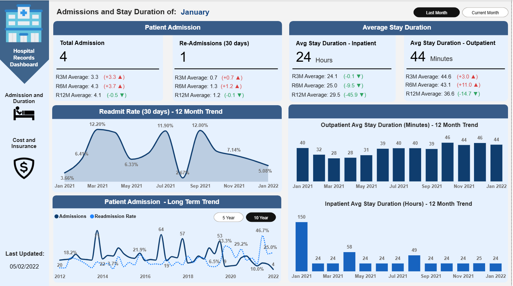
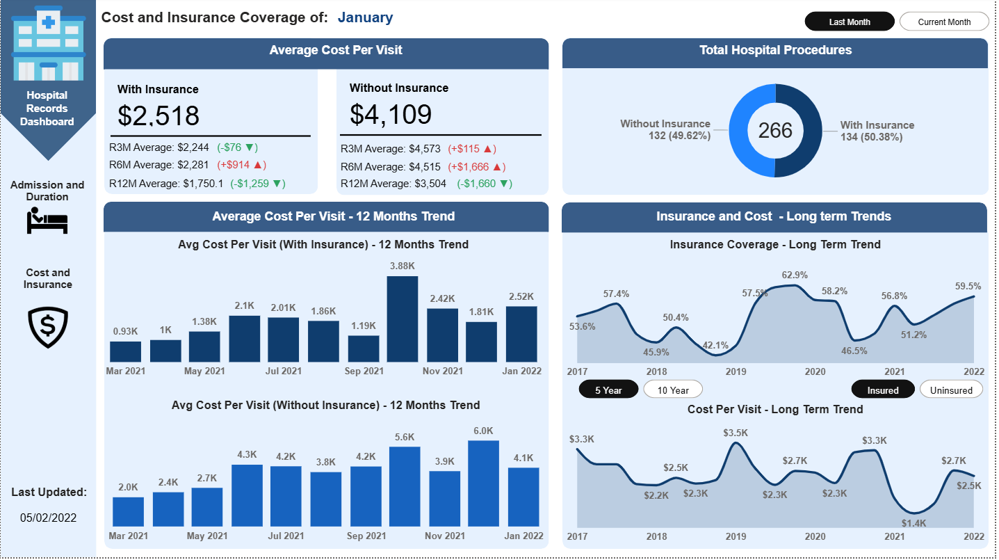
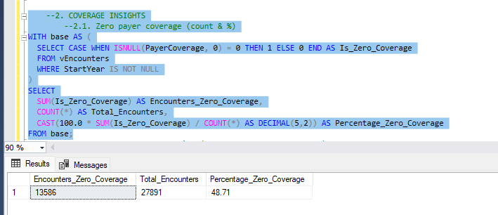
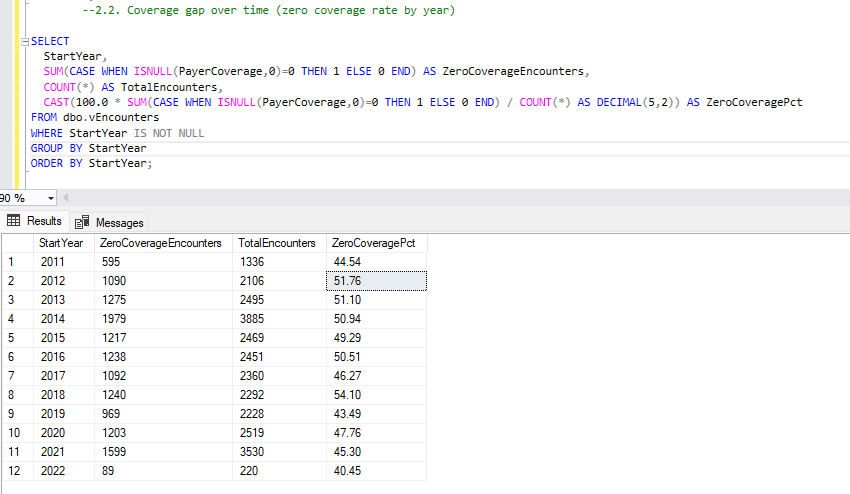
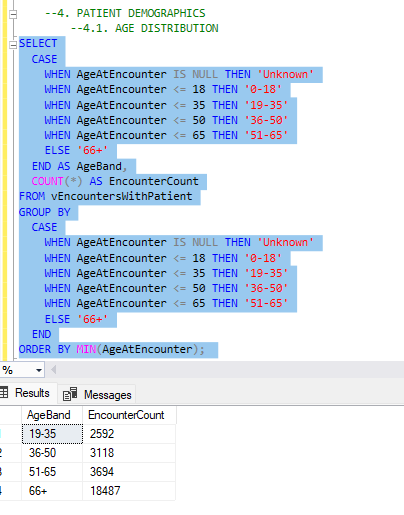
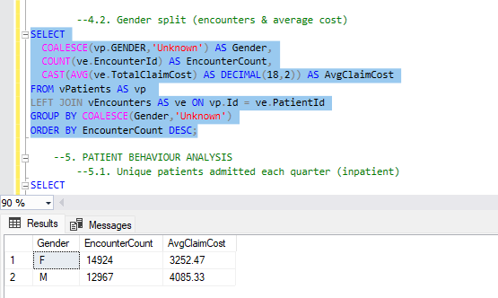

# 🏥 Hospital Patient Records Analytics – SQL + Power BI Project

This project analyses hospital patient records using SQL Server and Power BI. It provides insights into admissions, readmissions, patient demographics, insurance coverage, and procedure costs.
The project is split into two parts:

- Real-time trends in Power BI – for interactive monitoring and KPI tracking.
- Deep cleaning & analysis in SQL Server – for structured exploration of encounter data, patient demographics, procedures, and coverage gaps.

---

## 🎯 Project Objective

- Clean and query hospital records using SQL Server to answer key operational and clinical questions.
- Visualise real-time KPIs and long-term healthcare trends in Power BI.

---

## 🧰 Tools & Technologies

- SQL Server
- Power BI Desktop
- SSMS (SQL Server Management Studio)
- CSV patient record datasets

---

## 📁 Dataset Overview

The dataset includes multiple tables such as:

- `Encounters` – admission type, duration, costs, payer coverage
- `Patients` – demographics (age, gender, birthdate)
- `Payers` – insurance details
- `Procedures` – codes, descriptions, base cost
- `Organizations` – hospitals/locations

---

## 📈 Dashboard Pages & Visuals

**1. Admissions & Stay Duration (Power BI)**

  - KPIs: Total Admissions, Readmissions (30 days), Avg Stay (inpatient & outpatient)
  - Readmit Rate Trend (12 months)
  - Admissions Long-Term Trend (5/10 years)
  - Avg Stay by Inpatient vs Outpatient
    

**2. Cost & Insurance (Power BI)**

  - Avg Cost per Visit: With vs Without Insurance
  - Total Hospital Procedures by Coverage
  - Insurance Coverage Long-Term Trend
  - Cost per Visit Long-Term Trend

---

## 🔍 SQL Analysis

**1. Encounters Overview**

  - Total encounters per year
  - Encounter class distribution (ambulatory, outpatient, inpatient, emergency)
  - Encounter duration split (<24h vs ≥24h)

**2. Coverage Insights**

  - % of encounters with zero payer coverage (≈48.7% overall)
  - Coverage gap by year (2011–2022, improvement from >50% uninsured to ~40%)
  - Avg claim cost by payer

**3. Procedures & Clinical Insights**

  - Most frequent procedures: health/social care assessments, hospice, depression screening
  - Highest-cost procedures: ICU admission (~206K), cardiac surgeries (20–47K), colon resections (~25K)

**4. Patient Demographics**

  - Age distribution: majority 66+ (18K+ encounters), followed by 51–65
  - Gender split: balanced male/female, similar avg claim costs

## 📊 Key Insights

**1. Admissions & Readmissions**
  
  - Total encounters range between 2,200–3,500 per year, showing stable demand.

  - Ambulatory & outpatient visits dominate (~70%), while inpatient stays are fewer but costlier.

  - Readmissions within 30 days occur consistently, indicating opportunities for post-discharge improvement.
 

**2. Insurance Coverage**

  - Nearly half of encounters (≈48.7%) had no payer coverage, posing significant financial risk.

  - 2012–2015: uninsured cases exceeded 50%.
  - 2020–2022: uninsured burden declined to ~40%, showing gradual improvement.

**3. Procedures & Costs**

  - High-volume procedures: screenings, hospice care, depression & substance assessments.

  - High-cost procedures: ICU admission (~206K), cardiac surgeries (20–47K), colon resections (~25K).

  - Insight: Hospital runs on low-cost, high-volume preventive care, but faces spikes from rare, high-cost admissions.

**4. Patient Demographics**

  - Majority of encounters from elderly patients (66+ years = 18K+).
  - 51–65 years is the second-largest group (~3.7K encounters).

  - Gender split is balanced, with little cost difference between male & female patients.

## 🛠️ Recommended Actions

- Reduce readmissions: Target repeat patients with better discharge planning.
- Manage uninsured burden: Explore insurance expansion, subsidies, or payment assistance.
- Resource allocation: Tailor staff and services toward elderly patient care.
- Cost control: Closely monitor high-cost surgical admissions and ensure proper reimbursement.
